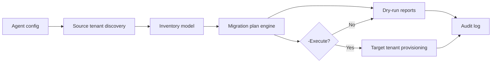

# Architecture

## Flow

## Design Principles

- Read-only source tenant access.
- Target tenant writes only when `-Execute` is specified.
- Plan first, execute second.
- Idempotency checks before supported writes.
- Reports are generated for review and approval.
- Data migration is intentionally out of scope.

